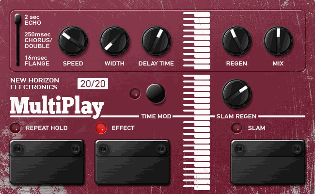

# MultiPlay 20/20

**A 1988 sampler disguised as a delay — now on your MOD.**

MultiPlay 20/20 by New Horizon Electronics recreates the DigiTech PDS 20/20 Multi-Play for MOD Duo, Duo X and Dwarf. It is modelled from the original factory schematics, with two of its owner's hardware mods built in.



## Why it sounds like nothing else

Most delays move a tap. The 20/20 changes the speed of the clock that walks a fixed loop of 8-bit memory. So:

- **Every sweep bends pitch**, like tape.
- **A held loop varispeeds**: freeze it, turn Delay Time, and it dives an octave and more into a grinding low end.
- **Repeats get darker and grittier** on every pass through the 8-bit converters and the NE570 compander.

## Controls

| Control | What it does |
| --- | --- |
| Range lever | 2 s echo · 250 ms chorus/double · 16 ms flange (click a legend line to select it) |
| Speed | LFO rate, about 0.07–18 Hz; faster also means shallower, as on the original |
| Width | Crossfades from the Delay Time knob to the LFO sweep |
| Delay Time | Sets the clock, 13:1 across the knob |
| Regen | Feedback, up to the edge of oscillation |
| Mix | Dry/wet on both outputs; both full around noon |
| Slam Regen | Feedback level while Slam is held; past 5 it runs away |
| Time Mod | Doubles every range: 4 s · 500 ms · 32 ms |
| Repeat Hold | Freezes the loop (latching) |
| Effect | Bypass: echoes muted, delay keeps running, dry at unity |
| Slam | Swaps Regen for Slam Regen while held (momentary by default) |
| Ramp Swell Time (settings) | How long Slam takes to swell in, 0.3–3 s; it falls back in twice that |

Mono in, two outputs. Output 2 carries the echoes in opposite polarity: wide in stereo, but don't sum the two outputs to mono.

## Install

**Test builds:** upload `mod-plugin-builder/nhe-multiplay/nhe-multiplay.mk` to <https://builder.mod.audio/buildroot> with your MOD connected over USB, then click Install. Set `NHE_MULTIPLAY_VERSION` in that file to the commit you want to build.

**MOD Plugin Store:** not yet. See [docs/release.md](docs/release.md).

## Build from source

```sh
make                 # builds bin/nhe-multiplay.lv2
make install DESTDIR=/path PREFIX=/usr
```

DPF (DISTRHO Plugin Framework) is vendored in `dpf/` at commit `61d38eb638449647fb8395a35c5b8dab7e981ba7`, so no submodules are needed. Cross-compile by setting `CC`, `CXX` and `CXXFLAGS` as usual.

Testing, the pedal-face workflow and the release checklist are in [docs/development.md](docs/development.md).

## Repository layout

| Path | Contents |
| --- | --- |
| `plugins/multiplay/` | DSP source (C++, DPF) |
| `bundle/nhe-multiplay.lv2/` | LV2 metadata, pedal face (template, CSS, script, images) |
| `assets/source/` | Source artwork and mockup for the face |
| `mod-plugin-builder/` | Package file for MOD's builder and plugin store |
| `tools/` | Offline LV2 test host, audio test suite, face renderer |
| `docs/` | Circuit notes, sound and quirks, development process, release checklist |
| `dpf/` | Vendored DISTRHO Plugin Framework (ISC) |

## Licence

Code: MIT ([LICENSE](LICENSE)). Artwork: © New Horizon Electronics ([ARTWORK-LICENSE.md](ARTWORK-LICENSE.md)). DPF: ISC ([dpf/LICENSE](dpf/LICENSE)).

DigiTech and Multi-Play are trademarks of their owners. This is an independent recreation, not affiliated with or endorsed by them.
